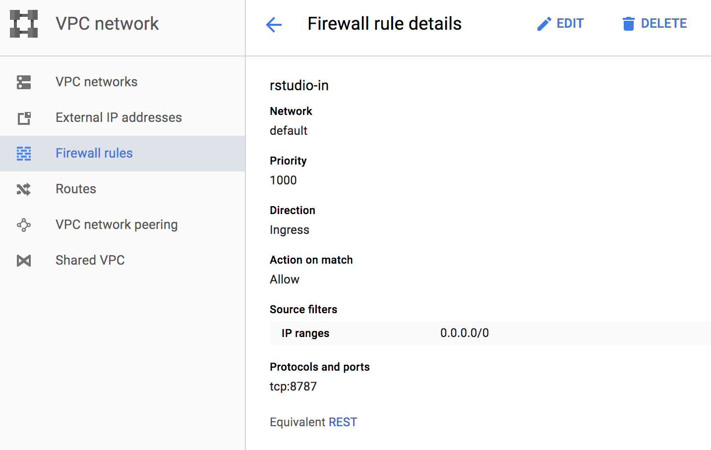
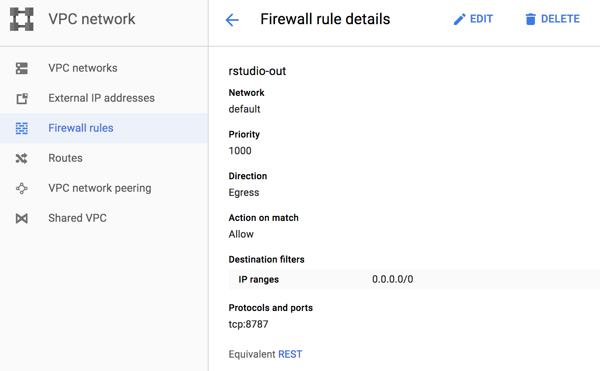

# Make a report

> Note: run these commands on the *remote computer*, not on your
> laptop.

We have completed the analysis, and produced a set of output files.
To get an idea of what it all means, we need to make a report. We'll
start again in our home directory.

To make our report we're going to install a web-based program called
RStudio on our Google Cloud instance.

Moving back to our home directory, we should see our project
directory, `deadmice`, and our pipeline software directory,
`sunbeam-master`.

```bash
cd ~
ls
```

We're going to turn off the `conda` environment for this process,
because it's more straightforward to install this software
system-wide.

```bash
source deactivate
```

We need to install some software required for RStudio.  The computer
will prompt you for confirmation, please answer "yes" as necessary.

```bash
sudo apt-get install r-base gdebi-core texlive texlive-latex-extra
```

Now, we'll download and install RStudio itself.

```bash
wget https://download2.rstudio.org/rstudio-server-1.1.383-amd64.deb
sudo gdebi rstudio-server-1.1.383-amd64.deb
```

For security, we neeed to create a diferent user account to access
RStudio in a web browser.  We'll call this new user "rstudiouser".
The computer will prompt you for a first and last name, along with
some other info for the account -- it's fine to leave this blank.

```bash
sudo adduser rstudiouser
```

Now, we'll create a link to our project directory inside the home
directory of `rstudiouser`.

```bash
sudo ln -s ${HOME}/deadmice /home/rstudiouser/deadmice
sudo chown -h rstudiouser:rstudiouser /home/rstudiouser/deadmice
```

As a last step before logging in, we need to adjust the firewall for
our Google Cloud instance.  Go to the Google Cloud console at
https://console.cloud.google.com/, then find "Networking" in the menu
on the left-hand side.




Once the firewall is configured, we'll try to connect to the web-based
software.  From the Google Cloud console, navigate to the page for
your compute instances, and find the IP address for your active
instance.  It will be four numbers separated by a ".", something like
18.21.15.85.  In a web browser, enter the IP address plus ":8787", for
example "18.21.15.85:8787".

If your effort was successful, you'll see a login screen, where you
should log in as rstudiouser.

Once you're in, you'll be presented with a rich interactive
environment, where you can plot data and run statistical tests.
Before we get started with that, we need to install some libraries.

This command should be run **inside the RStudio environment**, by
pasting into the window on the lower left.  There, you should see a
`>` prompt.

```r
install.packages(c("dplyr", "ggplot2", "readr", "tidyr", "qiimer", "reshape2", "vegan", "ape", "scales"))
```

Once you enter this command inside Rstudio, it will take about 10
minutes to install the libraries.

Next, we'll upload our report code into RStudio.  In the lower right
hand window, you'll see a button labelled "Upload."  Click that, and
select the report file on your local computer,
`workshop_report_gcloud.Rmd`.  If you're successful, the file will
appear in your file browser, in the lower right window.

Open the file in RStudio by clicking on it.  The report code should
open in the upper left window. At the top of this window, you'll see a
button called "Knit."  This is jargon for the software used to produce
the report.  Go ahead and hit the "Knit" button.  If all goes well, a
new window should open with your report in PDF format.


